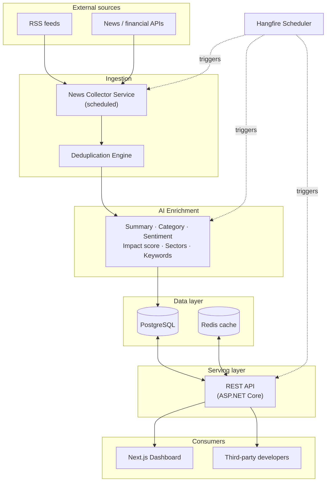
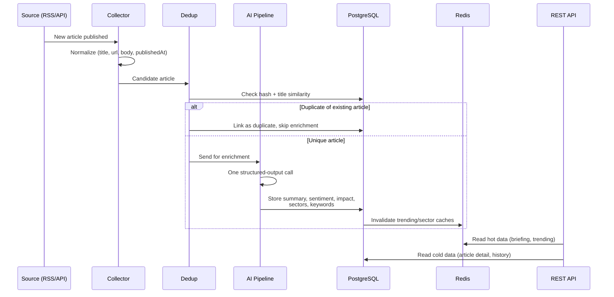

# Arunika — Application Design Document

*The First Light of Market Intelligence.*

This document expands the original Arunika concept into an implementable technical
design: architecture, data model, AI pipeline, API contracts, and the supporting
infrastructure decisions. It assumes the tech direction already suggested in the
project brief (ASP.NET Core, PostgreSQL, OpenAI, React/Next.js, Azure) and makes
concrete choices where the brief left things open, calling those out as they come up.

---

## 1. Purpose and design goals

Arunika ingests news from many sources and turns it into structured, decision-ready
intelligence — a summary, a topic, a sentiment, a market-impact score, affected
sectors, and keywords — for every article, then rolls the most important ones into
a daily briefing.

Design priorities, in order:

1. **Trustworthy enrichment** — the AI output must be consistently structured and
   safe to render directly in an API response, not free text to be re-parsed.
2. **Cost discipline** — news volume is high; AI calls are the most expensive part
   of the pipeline, so the design minimizes redundant calls (see §5, §6).
3. **A clean seam between ingestion and product** — collectors can be added or
   swapped without touching the API or dashboard.
4. **Ship V1 fast, extend without rewrites** — the schema and API are shaped so
   that V2–V4 features (auth, search, alerts) are additive, not migrations.

---

## 2. System architecture



### Layer responsibilities

| Layer | Responsibility | Key tech |
|---|---|---|
| Ingestion | Pull articles from RSS/APIs on a schedule, normalize into a common shape | Hangfire recurring job, `HttpClient` / feed readers |
| Deduplication | Detect exact and near-duplicate stories before they reach the AI step | Hash + title-similarity check |
| AI Enrichment | One structured call per unique article producing all derived fields | OpenAI/Claude structured outputs |
| Data layer | Durable storage + hot-path cache | PostgreSQL, Redis |
| Serving | Public/authenticated REST API, rate limiting, versioning | ASP.NET Core Web API |
| Consumers | Dashboard for end users, REST API for third-party developers | Next.js, API keys |
| Orchestration | Cron-like scheduling for every recurring job in the system | Hangfire |

**Why Clean Architecture at the code level:** Domain (entities, enums) has zero
external dependencies; Application defines use-case interfaces (`IArticleRepository`,
`INewsFetcher`, `IAiEnrichmentService`); Infrastructure implements them (EF Core,
OpenAI client, RSS parsers, Redis); API is a thin layer of controllers and
middleware. This means swapping OpenAI for Claude, or PostgreSQL for another store,
touches Infrastructure only.

---

## 3. Article lifecycle (data flow)



Duplicates are detected **before** the AI call, not after — this is the single
biggest cost lever in the system, since wire-service stories are commonly
republished by 5–15 outlets within the hour.

---

## 4. Domain model and database schema

```mermaid
erDiagram
    NEWS_SOURCE ||--o{ ARTICLE : publishes
    ARTICLE ||--o| ARTICLE : "duplicate of"
    ARTICLE ||--|| ARTICLE_ANALYSIS : has
    ARTICLE_ANALYSIS }o--|| CATEGORY : "classified as"
    ARTICLE ||--o{ ARTICLE_SECTOR_IMPACT : affects
    SECTOR ||--o{ ARTICLE_SECTOR_IMPACT : "impacted by"
    ARTICLE ||--o{ ARTICLE_KEYWORD : tagged
    KEYWORD ||--o{ ARTICLE_KEYWORD : appears
    BRIEFING ||--o{ BRIEFING_ITEM : includes
    ARTICLE ||--o{ BRIEFING_ITEM : featured
    USER ||--o{ WATCHLIST_ITEM : owns
    USER ||--o{ API_KEY : owns

    NEWS_SOURCE {
        uuid id PK
        string name
        string base_url
        string source_type "rss | api"
        int trust_score
        bool is_active
    }
    ARTICLE {
        uuid id PK
        uuid source_id FK
        string title
        string url
        text raw_content
        timestamptz published_at
        timestamptz fetched_at
        string dedupe_hash
        uuid duplicate_of_id FK
    }
    ARTICLE_ANALYSIS {
        uuid article_id PK_FK
        text summary
        uuid category_id FK
        string sentiment "bullish | bearish | neutral"
        float sentiment_confidence
        int impact_score "0-100"
        text impact_rationale
        string model_version
        timestamptz generated_at
    }
    CATEGORY {
        uuid id PK
        string name
    }
    SECTOR {
        uuid id PK
        string name
    }
    ARTICLE_SECTOR_IMPACT {
        uuid article_id FK
        uuid sector_id FK
        string direction "positive | negative | neutral"
        int magnitude "0-100"
    }
    KEYWORD {
        uuid id PK
        string text
    }
    ARTICLE_KEYWORD {
        uuid article_id FK
        uuid keyword_id FK
    }
    BRIEFING {
        uuid id PK
        date briefing_date
        text executive_summary
        string overall_sentiment
        string risk_level "low | medium | high"
        timestamptz generated_at
    }
    BRIEFING_ITEM {
        uuid briefing_id FK
        uuid article_id FK
        int rank
    }
    USER {
        uuid id PK
        string email
        string password_hash
        string role
        timestamptz created_at
    }
    WATCHLIST_ITEM {
        uuid id PK
        uuid user_id FK
        string filter_type "keyword | sector | category"
        string filter_value
        bool is_active
    }
    API_KEY {
        uuid id PK
        uuid owner_user_id FK
        string key_hash
        string tier
        timestamptz created_at
        timestamptz revoked_at
    }
```

Notes:

- `Article` holds only ingested fact; `ArticleAnalysis` holds everything AI-derived.
  Keeping them separate means re-running enrichment (new model version, corrected
  prompt) never touches ingestion data.
- Seed `Category` with the seven topics from the brief: Politics, Economy, Markets,
  Banking, Technology, Commodities, Crypto.
- Seed `Sector` with a practical GICS-like list: Energy, Financials, Technology,
  Industrials, Consumer, Healthcare, Real Estate, Materials, Utilities,
  Communication Services.
- Indexes: unique on `Article.url`, index on `Article.published_at` (briefing and
  feed queries are always time-ordered), and a `tsvector` full-text index on
  `title` + `raw_content` for V2 search.
- `duplicate_of_id` is nullable and self-referencing — duplicates stay in the table
  for audit/source-coverage purposes but are excluded from feeds and briefings by
  default.

---

## 5. AI enrichment pipeline

**Core decision: one structured-output call per unique article**, combining
summary, classification, sentiment, impact score, sector impact, and keywords —
rather than six separate calls. Six calls means 6x the latency and 6x the cost for
information that's all being reasoned about from the same input text at once.

Example schema (maps directly onto Gemini's `responseSchema` + `responseMimeType:
"application/json"` fields in `generationConfig` — the same shape also works as
OpenAI `response_format: json_schema` or an Anthropic tool definition, if the
provider ever changes):

```json
{
  "name": "analyze_article",
  "schema": {
    "type": "object",
    "properties": {
      "summary": {
        "type": "string",
        "description": "Neutral 2-3 sentence summary, no speculation"
      },
      "category": {
        "type": "string",
        "enum": ["Politics", "Economy", "Markets", "Banking", "Technology", "Commodities", "Crypto"]
      },
      "sentiment": { "type": "string", "enum": ["Bullish", "Bearish", "Neutral"] },
      "sentimentConfidence": { "type": "number", "minimum": 0, "maximum": 1 },
      "impactScore": {
        "type": "integer",
        "minimum": 0,
        "maximum": 100,
        "description": "Likely near-term market significance"
      },
      "impactRationale": { "type": "string" },
      "sectors": {
        "type": "array",
        "items": {
          "type": "object",
          "properties": {
            "sector": { "type": "string" },
            "direction": { "type": "string", "enum": ["Positive", "Negative", "Neutral"] },
            "magnitude": { "type": "integer", "minimum": 0, "maximum": 100 }
          },
          "required": ["sector", "direction", "magnitude"]
        }
      },
      "keywords": { "type": "array", "items": { "type": "string" }, "maxItems": 8 }
    },
    "required": ["summary", "category", "sentiment", "impactScore"],
    "additionalProperties": false
  }
}
```

Implementation notes:

- Wrap the model call behind an `IAiEnrichmentService` interface — the concrete
  provider is an Infrastructure-layer implementation, not a rewrite of anything
  above it. **Chosen provider: Google Gemini.** In C#, either the official
  `Google.GenAI` NuGet package or the community `Mscc.GenerativeAI` package wraps
  the `generateContent` endpoint; both support `responseSchema`.
- Retry with exponential backoff on transient failures; on repeated failure, mark
  the article `EnrichmentStatus = Failed` and let a sweep job retry later rather
  than blocking the ingestion pipeline.
- Log token usage per call from day one — it's the main variable operating cost
  and you'll want it broken down by source/category once volume grows.
- Gemini's Flash tier is a reasonable default for routine wire copy, with
  escalation to Pro only for articles that cross an early impact threshold —
  worth measuring before optimizing, not assuming upfront.

---

## 6. News collection and deduplication

**Collection**: a recurring job (see §8) pulls each configured source — RSS feeds
and one or two financial news/data APIs — normalizes fields, and hands off
candidates to deduplication. Treat each source's reliability and update frequency
as configuration, not code, so adding a source is a data change.

**Deduplication**, in order of cost (cheapest checks first):

1. **Exact match** — normalized URL or a hash of (normalized title + source).
2. **Near-duplicate** — title similarity (trigram/Jaccard similarity in Postgres,
   or cosine similarity over a cheap embedding) against articles published in the
   last ~48 hours. Wire stories ("Reuters", "AP") commonly appear near-verbatim
   across 5–15 outlets within an hour — this step is what keeps the AI bill sane.
3. On match, link `duplicate_of_id` to the earliest canonical article and skip
   enrichment; on no match, proceed to §5.

---

## 7. REST API design

### Conventions

- **Versioned URLs**: `/v1/...` as in the brief.
- **Envelope**: every response is `{ "data": ..., "meta": {...} }` on success, or
  `{ "error": { "code": "...", "message": "..." } }` on failure.
- **Pagination**: `page`, `pageSize` query params; `meta` includes `totalItems`
  and `totalPages`.
- **Auth**: `Authorization: Bearer <jwt>` for dashboard/user-scoped calls,
  `X-Api-Key` header for third-party developer access (see §10).

### Endpoints

**`GET /v1/news`** — list/filter articles.
Query params: `category`, `sentiment`, `sector`, `from`, `to`, `page`, `pageSize`.

```json
{
  "data": [
    {
      "id": "a1b2c3",
      "title": "Fed keeps interest rates unchanged",
      "source": "Reuters",
      "publishedAt": "2026-07-08T13:00:00Z",
      "category": "Markets",
      "sentiment": "Neutral",
      "impactScore": 82,
      "summary": "The Federal Reserve held its benchmark rate steady..."
    }
  ],
  "meta": { "page": 1, "pageSize": 20, "totalItems": 134, "totalPages": 7 }
}
```

**`GET /v1/articles/{id}`** — full detail: summary, sentiment, impact rationale,
sector breakdown, keywords, source, related/duplicate articles.

**`GET /v1/briefing?date=YYYY-MM-DD`** — the daily morning brief (defaults to today).

```json
{
  "data": {
    "date": "2026-07-08",
    "executiveSummary": "Markets are digesting a mixed set of signals today...",
    "overallSentiment": "Neutral",
    "riskLevel": "Medium",
    "topStories": [
      {
        "articleId": "a1b2c3",
        "title": "Fed keeps interest rates unchanged",
        "impactScore": 82,
        "sectors": ["Financials", "Real Estate"]
      }
    ],
    "watchlist": ["USD/JPY", "10Y US Treasury Yield", "WTI Crude"]
  },
  "meta": { "generatedAt": "2026-07-08T06:00:00Z" }
}
```

**`GET /v1/sentiment`** — aggregate sentiment, optional `groupBy=sector|category`
and `range=24h|7d`.

**`GET /v1/sectors`** — current sector impact snapshot.

**`GET /v1/trending`** — trending keywords/entities with mention counts and
sentiment trend.

**Auth endpoints (V2)**: `POST /v1/auth/register`, `POST /v1/auth/login`,
`POST /v1/auth/refresh`.

**Errors** follow one shape everywhere:

```json
{ "error": { "code": "NOT_FOUND", "message": "Article not found" } }
```

---

## 8. Background jobs (Hangfire)

| Job | Schedule | Purpose |
|---|---|---|
| `FetchNewsJob` | Every 10–15 min | Pull from all active sources |
| `EnrichArticleJob` | Fire-and-forget, per unique article | Runs the AI pipeline (§5) |
| `RecalculateTrendingJob` | Every 15 min | Refresh trending keywords cache |
| `GenerateDailyBriefingJob` | Daily, fixed time (e.g. 06:00 local) | Aggregate top stories, generate executive summary |
| `SendEmailDigestJob` (V3) | Daily/weekly | Render and send digest emails |
| `EvaluateAlertsJob` (V4) | Every few minutes | Match new articles against user watchlists |
| `RetryFailedEnrichmentJob` | Hourly | Sweep articles where AI enrichment failed |

The Hangfire dashboard doubles as an operational view during V1 — worth exposing
(behind auth) from day one rather than adding observability later.

---

## 9. Caching strategy (Redis)

| Key | Contents | Invalidation |
|---|---|---|
| `briefing:{date}` | Rendered daily briefing | Regenerated once/day, or on manual refresh |
| `trending:current` | Trending keyword list | Every 15 min (RecalculateTrendingJob) |
| `sector-sentiment:{range}` | Aggregate sentiment by sector | On new enrichment completing |
| `ratelimit:{apiKey}` | Rolling request count | Sliding window, per-key TTL |

Everything else (article detail, historical queries) reads straight from
PostgreSQL — it's not hot enough to justify cache invalidation complexity at V1.

---

## 10. Authentication, API keys, and security

- **Dashboard/user auth**: JWT access token (short-lived, ~15 min) + refresh token
  (~7 days). Standard login/refresh flow; passwords hashed (e.g. BCrypt/Argon2),
  never stored or logged in plaintext.
- **Public API auth**: a separate `X-Api-Key` mechanism for third-party
  developers, independent of user JWTs — a key can be issued to an
  organization without that organization having a dashboard login.
- **Rate limiting**: tiered by API key (e.g. free: 60 req/min & 1,000/day; paid:
  higher) — treat these numbers as a starting point to tune against real usage,
  not a commitment.
- **Input handling**: sanitize ingested HTML/content before ever rendering it
  (you're storing text pulled from arbitrary third-party sources).
- **Secrets**: local dev uses `dotnet user-secrets`; production uses Azure Key
  Vault — API keys, DB connection strings, and OpenAI/Claude keys are never
  committed or stored in appsettings files.
- **CORS**: dashboard origin allow-listed explicitly; the public API is opener by
  design (API-key gated instead of origin-gated).

---

## 11. Frontend / dashboard

V1 pages: **Today's Briefing** (home), **News Feed** (filterable by category/
sentiment/sector), **Article Detail**, **Sector Overview**. V2 adds **Search** and
**Login/Account**.

- Next.js (App Router), data fetched server-side for the briefing/feed (good for
  SEO and first paint) and client-side (SWR or React Query) for interactive
  filtering.
- Keep the component library minimal at V1 — Tailwind utility classes are enough
  until the design has settled; introducing a component system too early tends to
  get reworked anyway once real content is in front of it.

---

## 12. Solution and repository structure

```
arunika/
├── backend/
│   ├── src/
│   │   ├── Arunika.Domain/          # Entities, enums — no external deps
│   │   ├── Arunika.Application/     # Use-case interfaces, DTOs, validation
│   │   ├── Arunika.Infrastructure/  # EF Core, AI client, fetchers, Redis, Hangfire jobs
│   │   └── Arunika.Api/             # Controllers, middleware, Program.cs, Swagger
│   ├── tests/
│   │   ├── Arunika.UnitTests/
│   │   └── Arunika.IntegrationTests/
│   └── Arunika.sln
├── frontend/
│   └── arunika-dashboard/           # Next.js app
├── docker-compose.yml               # Postgres + Redis for local dev
├── .github/workflows/
│   ├── ci.yml
│   └── cd.yml
└── docs/
    ├── Arunika-Application-Design.md
    └── Arunika-Project-Todo-List.md
```

`docker-compose.yml` starting point:

```yaml
services:
  postgres:
    image: postgres:16
    environment:
      POSTGRES_DB: arunika
      POSTGRES_USER: arunika
      POSTGRES_PASSWORD: devpassword
    ports: ["5432:5432"]
    volumes: ["pgdata:/var/lib/postgresql/data"]
  redis:
    image: redis:7
    ports: ["6379:6379"]
volumes:
  pgdata:
```

---

## 13. Non-functional requirements

- **Logging**: Serilog, structured (JSON) sinks — console locally, Application
  Insights in Azure.
- **Monitoring**: Hangfire dashboard for job health; Application Insights for API
  latency/error rates; alert on enrichment failure rate crossing a threshold.
- **Testing**: xUnit for Domain/Application logic (dedup matching, impact-score
  edge cases); integration tests against a real Postgres test container for API
  endpoints.
- **CI/CD**: GitHub Actions — build + test on every PR; deploy to staging on merge
  to `main`; deploy to production on tagged release.

---

## 14. Technology stack

| Layer | Technology | Note |
|---|---|---|
| Backend | ASP.NET Core Web API, **.NET 10 (LTS)** | .NET 8/9 both age out Nov 2026 |
| Database | PostgreSQL 16 | Chosen over SQL Server — no licensing cost, strong JSONB support |
| ORM | Entity Framework Core 10 | |
| Scheduler | Hangfire | Dashboard doubles as ops view |
| AI | OpenAI GPT-5-series **or** Claude Sonnet 5 / Haiku 4.5 | Provider-agnostic via `IAiEnrichmentService` |
| News/market data | RSS + Finnhub / Financial Modeling Prep / Alpha Vantage (pick 1–2 to start) | See §6 |
| Cache | Redis 7 | |
| Frontend | React + Next.js (App Router) | |
| Auth | JWT (users) + API keys (developers) | |
| API docs | Swagger / OpenAPI | |
| Deployment | Azure App Service / Container Apps, Azure Database for PostgreSQL, Azure Cache for Redis | |
| CI/CD | GitHub Actions | |
| Logging | Serilog + Application Insights | |

---

## 15. Compliance and legal considerations

Arunika publishes sentiment scores and impact ratings on financial news — treat
this as content that needs a clear "informational, not financial/investment
advice" disclaimer in the product itself. Depending on where you operate and who
you target (e.g. Indonesia's OJK, or securities regulators in other markets),
there may be specific disclosure requirements for this kind of content — worth a
short conversation with legal counsel before public launch rather than after.
Separately, confirm the redistribution/commercial-use terms of each news and
market-data API before scaling past a prototype; free tiers in this space often
restrict commercial reuse.

---

## 16. Open decisions to revisit

- PostgreSQL vs. SQL Server — this doc assumes Postgres; revisit if the team has
  existing SQL Server/Azure SQL licensing.
- Single AI provider vs. a cost-tiered mix (cheap model for routine articles,
  stronger model above an impact threshold).
- Which 1–2 news/market-data providers to start with — §6 and the to-do list both
  leave this as a first-week decision rather than baking in one choice.
- Monorepo vs. split repos — assumed monorepo for MVP; revisit if backend/frontend
  end up on different release cadences.