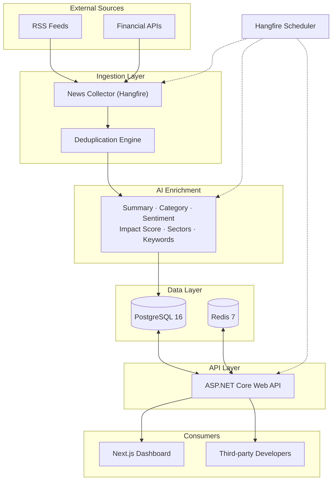

# Arunika

> **The First Light of Market Intelligence**

Arunika ingests news from multiple sources and transforms it into structured, decision-ready intelligence — a summary, topic classification, sentiment analysis, market-impact score, affected sectors, and keywords — for every article, then rolls the most important stories into a daily briefing.

[](https://github.com/Kadmiel/arunika/actions/workflows/ci.yml)
[](https://github.com/Kadmiel/arunika/actions/workflows/cd.yml)
[](https://opensource.org/licenses/MIT)
[](https://dotnet.microsoft.com/)
[](https://nextjs.org/)
[](https://www.postgresql.org/)
[](https://redis.io/)

---

## Architecture Overview



### Tech Stack

| Layer | Technology |
|-------|------------|
| **Backend API** | ASP.NET Core 10, Clean Architecture |
| **Database** | PostgreSQL 16 + EF Core 10 |
| **Cache** | Redis 7 |
| **Scheduler** | Hangfire |
| **AI Enrichment** | Google Gemini (structured output) |
| **News Sources** | RSS + Financial Modeling Prep |
| **Frontend** | Next.js 16 (App Router), React 19, Tailwind CSS 4 |
| **Auth** | JWT (users) + API Keys (developers) |
| **Deployment** | Backend: Render (Docker) · Frontend: Vercel |
| **CI/CD** | GitHub Actions |

---

## Quick Start

### Prerequisites

- [.NET 10 SDK](https://dotnet.microsoft.com/download/dotnet/10.0)
- [Node.js LTS](https://nodejs.org/) + npm
- [Docker Desktop](https://www.docker.com/products/docker-desktop/)
- [Gemini API Key](https://aistudio.google.com/apikey)
- [FinancialModelingPrep API Key](https://site.financialmodelingprep.com/developer/docs)

### 1. Clone & Start Infrastructure

```bash
git clone https://github.com/Kadmiel/arunika.git
cd arunika

# Start PostgreSQL + Redis
docker-compose up -d
```

### 2. Configure Backend Secrets

```bash
cd backend/src/Arunika.Api

dotnet user-secrets set "ConnectionStrings:DefaultConnection" "Host=localhost;Port=5432;Database=arunika;Username=arunika;Password=devpassword"
dotnet user-secrets set "Gemini:ApiKey" "<your-gemini-api-key>"
dotnet user-secrets set "FinancialModelingPrep:ApiKey" "<your-fmp-api-key>"

cd ../../..
```

### 3. Apply Database Migrations

```bash
cd backend
dotnet ef database update --project src/Arunika.Infrastructure --startup-project src/Arunika.Api
```

### 4. Run Backend API

```bash
# From backend/
dotnet run --project src/Arunika.Api
```

**Backend URLs:**
- API: `http://localhost:5097`
- Swagger: `http://localhost:5097/swagger` (Development only)
- Hangfire Dashboard: `http://localhost:5097/hangfire`
- Health Check: `http://localhost:5097/health`

### 5. Run Frontend Dashboard

```bash
# In a new terminal
cd frontend/arunika-dashboard
npm install
npm run dev
```

**Frontend URL:** `http://localhost:3000`

> The dashboard calls the backend at `http://localhost:5097` by default. Override with `.env.local`:
> `NEXT_PUBLIC_API_BASE_URL=http://localhost:5097`

### 6. Stop Services

```bash
docker-compose down
```

---

## Project Structure

```
arunika/
├── backend/
│   ├── src/
│   │   ├── Arunika.Domain/          # Entities, enums — zero external deps
│   │   ├── Arunika.Application/     # Use-case interfaces, DTOs, services
│   │   ├── Arunika.Infrastructure/  # EF Core, AI client, fetchers, Hangfire jobs
│   │   └── Arunika.Api/             # Controllers, middleware, Program.cs
│   ├── tests/
│   │   ├── Arunika.UnitTests/
│   │   └── Arunika.IntegrationTests/
│   ├── Dockerfile
│   └── Arunika.slnx
├── frontend/
│   └── arunika-dashboard/           # Next.js 16 App Router
│       ├── src/
│       │   ├── app/                 # Pages (App Router)
│       │   ├── components/          # React components
│       │   └── lib/                 # Utilities, API client, auth
│       └── public/
├── supabase/                        # Edge functions for email
├── docker-compose.yml               # Postgres + Redis for local dev
├── .github/workflows/
│   ├── ci.yml                       # Build + test on PR/push
│   └── cd.yml                       # Deploy to Vercel + Render
├── LICENSE
├── CONTRIBUTING.md
├── SECURITY.md
├── CHANGELOG.md
└── README.md
```

---

## API Endpoints (v1)

| Endpoint | Description |
|----------|-------------|
| `GET /v1/news` | Paginated article list with filters (category, sentiment, sector, date range) |
| `GET /v1/articles/{id}` | Full article detail: summary, sentiment, impact rationale, sectors, keywords |
| `GET /v1/briefing?date=YYYY-MM-DD` | Daily briefing with executive summary, top stories, watchlist |
| `GET /v1/sectors` | Sector impact snapshot |
| `GET /v1/sentiment` | Aggregate sentiment (group by sector/category, range 24h/7d) |
| `GET /v1/trending` | Trending keywords with mention counts |
| `GET /health` | Health check |
| `POST /v1/auth/register` | User registration |
| `POST /v1/auth/login` | User login (JWT) |
| `POST /v1/auth/refresh` | Refresh access token |

**Response Envelope (success):**
```json
{ "data": { ... }, "meta": { "page": 1, "pageSize": 20, "totalItems": 134 } }
```

**Error Envelope:**
```json
{ "error": { "code": "NOT_FOUND", "message": "Article not found" } }
```

---

## Development

### Backend Commands

```bash
cd backend

# Build
dotnet build

# Run tests
dotnet test

# Add migration
dotnet ef migrations add <Name> --project src/Arunika.Infrastructure --startup-project src/Arunika.Api

# Update database
dotnet ef database update --project src/Arunika.Infrastructure --startup-project src/Arunika.Api
```

### Frontend Commands

```bash
cd frontend/arunika-dashboard

# Dev server
npm run dev

# Production build
npm run build

# Start production server
npm start

# Lint
npm run lint
```

---

## Deployment

### Backend → Render (Docker)

1. Create a **PostgreSQL** database on Render
2. Create a **Redis** instance (optional for V1)
3. Create a **Web Service** from this repo:
   - Root Directory: `backend`
   - Runtime: `Docker` (uses `backend/Dockerfile`)
4. Set environment variables:
   | Key | Value |
   |-----|-------|
   | `ConnectionStrings__DefaultConnection` | Render Postgres connection string |
   | `Gemini__ApiKey` | Your Gemini API key |
   | `FinancialModelingPrep__ApiKey` | Your FMP API key |
   | `ASPNETCORE_ENVIRONMENT` | `Production` |
5. Deploy → Run migrations against Render DB:
   ```bash
   dotnet ef database update --connection "<external-connection-string>"
   ```

### Frontend → Vercel

1. Import repo in Vercel
2. Root Directory: `frontend/arunika-dashboard`
3. Add env var: `NEXT_PUBLIC_API_BASE_URL=https://<your-render-service>.onrender.com`
4. Deploy

---

## Mobile / PWA

The Next.js dashboard works as a **Progressive Web App** out of the box:
- Installable on Android/iOS from browser
- Offline-capable with service worker (add `next-pwa`)
- Responsive design (Tailwind CSS)

For native app store deployment, wrap with **Capacitor**:
```bash
cd frontend/arunika-dashboard
npm install @capacitor/core @capacitor/cli
npx cap init arunika com.arunika.app
npx cap add android ios
npx cap sync
```
No separate repository needed — Capacitor lives inside the frontend folder.

---

## Contributing

See [CONTRIBUTING.md](CONTRIBUTING.md) for guidelines on:
- Code style & conventions
- Pull request process
- Commit message format
- Testing requirements

---

## Security

See [SECURITY.md](SECURITY.md) for:
- Supported versions
- Reporting vulnerabilities
- Security best practices

---

## Changelog

See [CHANGELOG.md](CHANGELOG.md) for release history.

---

## License

MIT License — see [LICENSE](LICENSE) for details.

---

## Disclaimer

> Arunika provides **informational market intelligence only**, not financial or investment advice. Sentiment scores and impact ratings are AI-generated estimates. Always do your own research and consult qualified professionals before making financial decisions.

---

## Links

- [Application Design Document](Arunika-Application-Design.md)
- [Project Todo List](Arunika-Project-Todo-List.md)
- [Frontend Dashboard README](frontend/arunika-dashboard/README.md)